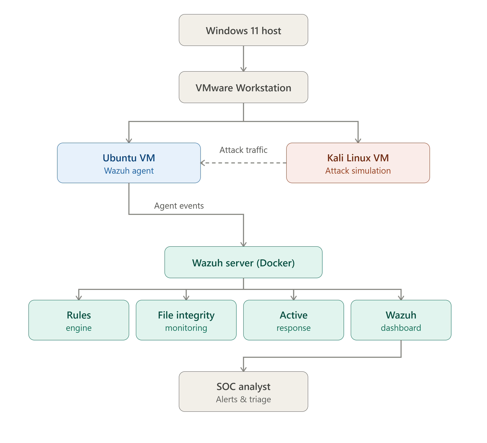
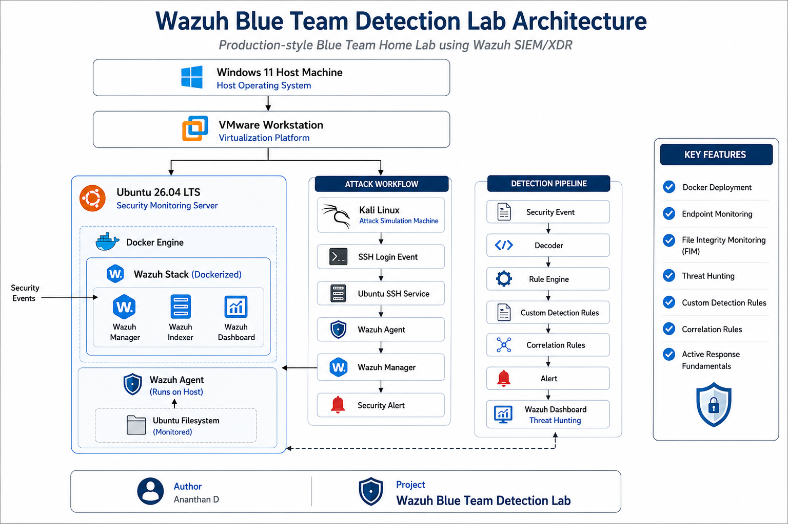

# 🛡️ Wazuh Blue Team Detection Lab

<p align="center">
  
</p>

> A production-style Wazuh SIEM/XDR home lab built using Ubuntu and Docker to gain hands-on experience in security monitoring, threat detection, detection engineering, File Integrity Monitoring (FIM), Active Response, and incident investigation.


---

## 📖 Overview

This project documents the development of a Blue Team home lab using Wazuh SIEM/XDR. The lab was built to understand how security events are collected, analyzed, and investigated in a Security Operations Center (SOC).

The project includes:

- Deployment of a Wazuh single-node environment using Docker
- Endpoint monitoring with the Wazuh Agent
- File Integrity Monitoring (FIM)
- Threat Hunting using the Wazuh Dashboard
- Custom detection rule development
- Correlation rule implementation
- Active Response configuration and testing
- Investigation of security events through practical exercises

The repository also contains detailed day-by-day documentation, screenshots, and supporting resources created throughout the project.

## 📑 Table of Contents

- [🛡️ Wazuh Blue Team Detection Lab](#️-wazuh-blue-team-detection-lab)
  - [📖 Overview](#-overview)
  - [📑 Table of Contents](#-table-of-contents)
  - [🎯 Project Objectives](#-project-objectives)
- [🏗️ Lab Architecture](#️-lab-architecture)
- [✨ Features Implemented](#-features-implemented)
  - [🚀 Wazuh SIEM Deployment](#-wazuh-siem-deployment)
  - [🖥️ Endpoint Monitoring](#️-endpoint-monitoring)
  - [📂 File Integrity Monitoring (FIM)](#-file-integrity-monitoring-fim)
  - [🔍 Threat Hunting](#-threat-hunting)
  - [⚙️ Detection Engineering](#️-detection-engineering)
  - [🛡️ Active Response](#️-active-response)
- [🛠️ Technology Stack](#️-technology-stack)
- [📁 Repository Structure](#-repository-structure)
- [🎯 Skills Demonstrated](#-skills-demonstrated)
- [🛠️ Challenges \& Troubleshooting](#️-challenges--troubleshooting)
- [📚 References](#-references)
- [👨‍💻 Author](#-author)

---

## 🎯 Project Objectives

The primary objectives of this project were to:

- Deploy a production-style Wazuh SIEM/XDR environment using Docker.
- Monitor endpoint activity using the Wazuh Agent.
- Configure File Integrity Monitoring (FIM) to detect file system changes.
- Investigate security events through the Wazuh Dashboard and Threat Hunting.
- Develop and validate custom Wazuh detection rules.
- Implement correlation rules to improve alert quality.
- Explore Active Response automation using custom scripts.
- Document each stage of the lab to build a professional Blue Team portfolio.

---

# 🏗️ Lab Architecture

The lab consists of a Windows 11 host running VMware Workstation with two virtual machines:

- **Ubuntu 26.04 LTS** – Hosts the Dockerized Wazuh SIEM/XDR stack and the Wazuh Agent.
- **Kali Linux** – Used to generate SSH login events and simulate attack activity for detection testing.

Security events are collected by the Wazuh Agent, processed by the Wazuh Manager, analyzed through custom detection rules and correlation rules, and finally investigated using the Wazuh Dashboard.



# ✨ Features Implemented

## 🚀 Wazuh SIEM Deployment

- Deployed a production-style Wazuh 4.14.6 single-node environment using Docker.
- Configured the Wazuh Manager, Indexer, and Dashboard.
- Generated TLS certificates for secure communication.
- Verified container health and successful dashboard access.

---

## 🖥️ Endpoint Monitoring

- Installed and configured the Wazuh Agent on Ubuntu.
- Registered the monitored endpoint with the Wazuh Manager.
- Verified agent connectivity and event collection.

---

## 📂 File Integrity Monitoring (FIM)

- Configured File Integrity Monitoring.
- Detected file creation, modification, and deletion events.
- Investigated FIM alerts using the Wazuh Dashboard.
- Analyzed generated alerts and associated rule IDs.

---

## 🔍 Threat Hunting

- Investigated security events through the Wazuh Dashboard.
- Analyzed alert metadata.
- Examined JSON event logs.
- Understood rule severity levels and event context.

---

## ⚙️ Detection Engineering

- Developed custom Wazuh detection rules.
- Modified built-in rule logic.
- Implemented rule inheritance using `if_sid`.
- Created correlation rules using frequency and timeframe conditions.
- Validated custom alerts through practical testing.

---

## 🛡️ Active Response

- Developed a custom Active Response Bash script.
- Registered custom commands within Wazuh.
- Configured Active Response for custom detection rules.
- Manually validated script execution.
- Investigated the Active Response workflow and debugging process.

---

# 🛠️ Technology Stack

| Category | Technology |
|----------|------------|
| Operating System | Ubuntu 26.04 LTS |
| Host Operating System | Windows 11 |
| Virtualization | VMware Workstation |
| Containerization | Docker Engine, Docker Compose |
| SIEM / XDR | Wazuh 4.14.6 |
| Endpoint Monitoring | Wazuh Agent |
| Attack Simulation | Kali Linux |
| Version Control | Git, GitHub |
| Documentation | Markdown, VS Code |

# 📁 Repository Structure

```text
Project-01-Wazuh-Blue-Team-Lab/
│
├── architecture/
│   ├── wazuh-blue-team-architecture.drawio
│   └── wazuh-blue-team-architecture.png
│
├── attack-simulation/
│
├── diagrams/
│
├── docs/
│   ├── Day01.md
│   ├── Day02.md
│   ├── Day03.md
│   ├── Day04.md
│   ├── Day05.md
│   ├── Day06.md
│   ├── Day07.md
│   ├── Day08.md
│   └── Day09.md
│
├── reports/
│
├── rules/
│
├── screenshots/
│   ├── active-response/
│   ├── dashboard/
│   ├── detection-rules/
│   ├── fim/
│   ├── setup/
│   ├── threat-hunting/
│   └── troubleshooting/
│
├── scripts/
│
└── README.md
```
# 🎯 Skills Demonstrated

Throughout this project, I gained practical experience in:

- SIEM Deployment and Administration
- Docker Container Management
- Linux System Administration
- Endpoint Security Monitoring
- File Integrity Monitoring (FIM)
- Threat Hunting
- Detection Engineering
- Custom Wazuh Rule Development
- Correlation Rule Implementation
- Active Response Fundamentals
- Security Event Investigation
- Log Analysis
- Technical Documentation
- Git and GitHub Version Control

# 🛠️ Challenges & Troubleshooting

During the project, several deployment and configuration challenges were encountered and resolved.

Major issues included:

- Docker image tag mismatch
- Wazuh Dashboard image not found
- TLS certificate generation
- Docker container permission issues
- Wazuh configuration validation
- SSH public key authentication troubleshooting
- Custom rule validation errors
- Active Response debugging
- Agent log collection troubleshooting

Resolving these issues improved my understanding of Linux administration, Docker, Wazuh internals, and systematic troubleshooting.

# 📚 References

- Wazuh Documentation
- Docker Documentation
- Ubuntu Documentation
- VMware Workstation Documentation
- MITRE ATT&CK Framework

# 👨‍💻 Author

**Ananthan D**

Aspiring SOC Analyst | Blue Team | Detection Engineering

- GitHub: https://github.com/ananthancyber
- LinkedIn: https://www.linkedin.com/in/ananthan-d-ab295321b